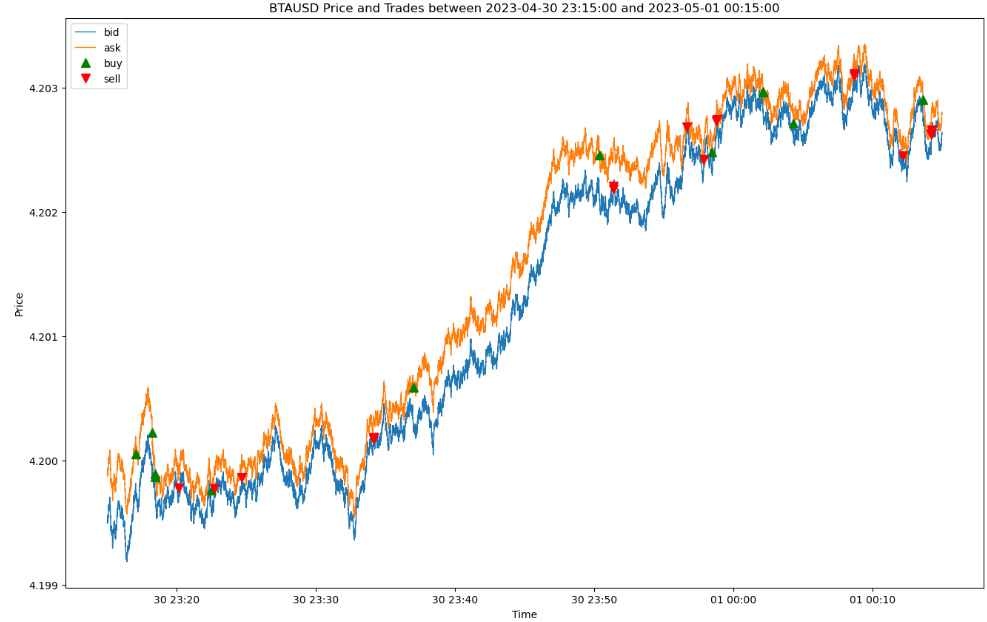
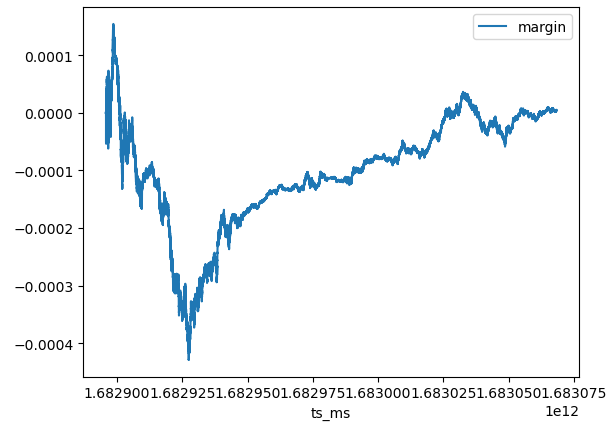
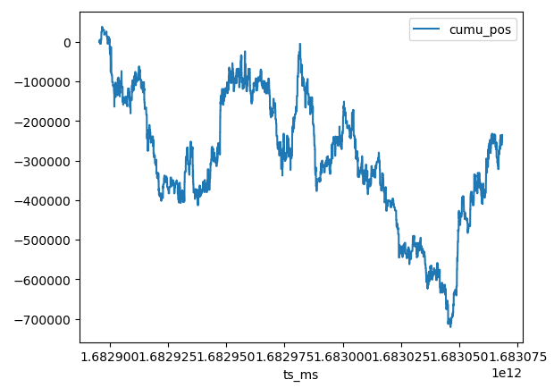
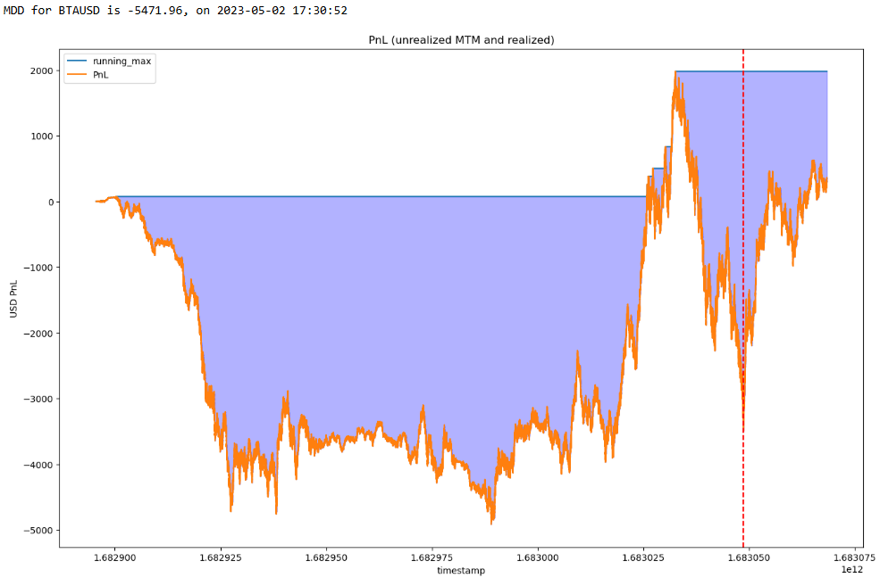

# Strategy Markout
This is a project that plots strategy aggregate markout curve. It can be used to analyse the change in price after your trade has been executed. It is possible to see some market impact after a trade has been executed, such as moving against you.

## Content

## How to use
1. download the files,
2. open the jupyter notebook file, run script

## Results and insights

.png)

.png)

